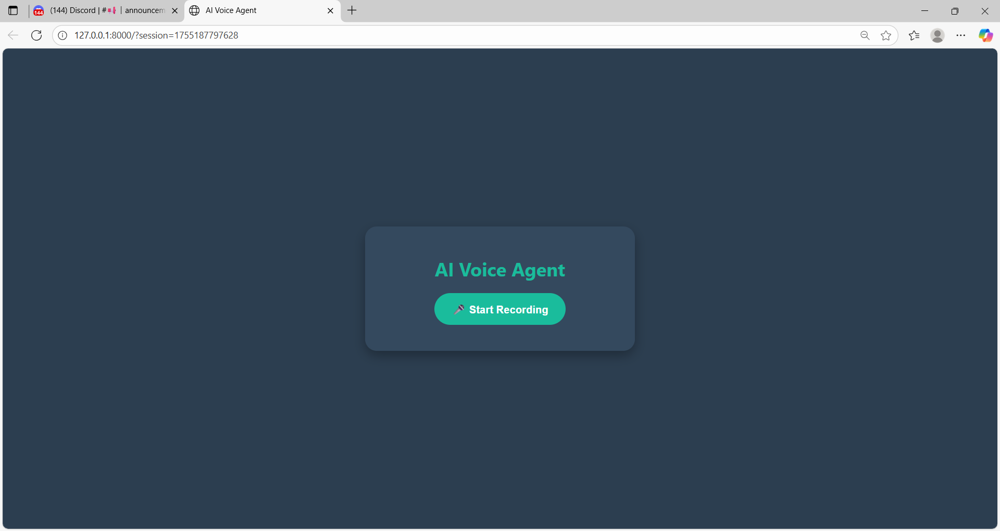

# 🎤 AI Voice Agent – 30 Days of Voice Agents Challenge

A full-stack conversational AI voice agent built as part of the #30DaysofVoiceAgents challenge with Murf AI! This project combines speech-to-text, powerful LLM conversation, and realistic voice synthesis, wrapped in a modern, voice-centric UI.

---

## 🚀 Features

-  **Voice-first conversation UI** (single record button with animated states)
-  **Conversation memory**: Multi-turn dialogue, remembers context per session
-  **Speech-to-text**: Uses AssemblyAI for accurate voice transcription
-  **AI responses**: Google Gemini LLM generates context-aware replies
-  **Text-to-speech**: Murf AI delivers human-like audio responses
-  **Automatic error handling** with fallback spoken messages
-  **Modern design:** Clean, focused, and accessible UI
-  **Keyboard shortcuts**: Use spacebar to start/stop recording
-  **Robust error handling**: Graceful fallbacks for all API failures

---
## 📸 Screenshots

Task day 12 completed UI:


---

## 🔧 Tech Stack

- **Frontend:** HTML5, CSS3, vanilla JavaScript
- **Backend:** FastAPI (Python)
- **APIs/AI Services:** AssemblyAI (STT), Google Gemini LLM, Murf AI (TTS)
- **Others:** dotenv for environment variables, Uvicorn as ASGI server

---

## ⚙️ Getting Started

### 1. **Clone the repository**
```bash
git clone https://github.com/venkatthirupathi/Murf_ai_project.git
cd Murf_ai_project
```

### 2. **Install dependencies**
```bash
pip install -r requirements.txt
```

### 3. **Set environment variables**
Create a file called `.env` in the project root and add:

```bash
MURF_API_KEY=your-murf-api-key
ASSEMBLYAI_API_KEY=your-assemblyai-api-key
GEMINI_API_KEY=your-gemini-api-key
```

> **Note:** All 3 keys are required for full functionality. Get them from the respective providers.

### 4. **Run the server**

**Option A: Using the startup script (recommended)**
```bash
python run.py
```

**Option B: Using uvicorn directly**
```bash
python -m uvicorn app:app --reload
```

Then open [http://localhost:8000](http://localhost:8000) in your browser.

---

## 🔑 Getting API Keys

1. **Murf AI**: Sign up at [murf.ai](https://murf.ai) and get your API key
2. **AssemblyAI**: Sign up at [assemblyai.com](https://assemblyai.com) and get your API key  
3. **Google Gemini**: Get your API key from [Google AI Studio](https://makersuite.google.com/app/apikey)

---

## 🎯 Usage

1. **Click the microphone button** or press **spacebar** to start recording
2. **Speak your message** clearly into your microphone
3. **Click again or press spacebar** to stop recording
4. **Wait for AI response** - it will automatically play the audio
5. **Recording automatically resumes** after the AI finishes speaking

---

## 🛠️ Troubleshooting

- **Microphone not working**: Check browser permissions and refresh the page
- **API errors**: Verify all API keys are set correctly in your `.env` file
- **Audio not playing**: Check browser console for errors
- **Connection issues**: Ensure all services are accessible from your network

---

## 📁 Project Structure

```
Murf_ai/
├── app.py              # Main FastAPI application
├── run.py              # Startup script
├── requirements.txt    # Python dependencies
├── schemas/           # Pydantic data models
├── services/          # API service integrations
├── static/            # Frontend assets (CSS, JS)
├── templates/         # HTML templates
└── SETUP.md           # Detailed setup instructions
```

---

## ✨ Credits

- Built as part of the #30DaysofVoiceAgents by THIRUPATHI VENKAT
- Thanks to [Murf AI](https://murf.ai), [AssemblyAI](https://assemblyai.com), and [Google Gemini](https://deepmind.google/technologies/gemini/) for their APIs and inspiration

#BuildwithMurf #30DaysofVoiceAgents #AI #VoiceBot #FastAPI #MurfAI
